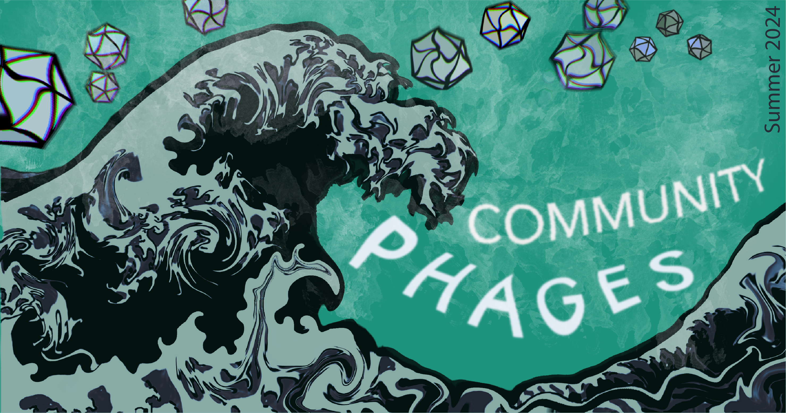

    

        
    

{: .fs-7}
# Welcome to the Community Phages 2024 program website!

Community Phages is an 8-week summer research internship program where undergraduate students from neighboring Roxbury Community College will partner with researchers in the [Bernhardt](http://www.bernhardtlab.com) and [Baym](https://baymlab.hms.harvard.edu) laboratories at Harvard Medical School to isolate novel bacteriophages. The program is supported by the Howard Hughes Medical Institute.

This website serves as a centralized hub for our protocols and resources. Find out more about the Community Phages 2024 program and organizers on the [About the Program](./about) page.

---

    [Lab Protocols](./labprotocols){: .btn .d-inline-block}
    [Bioinformatics](./bioinformatics){: .btn .d-inline-block}

