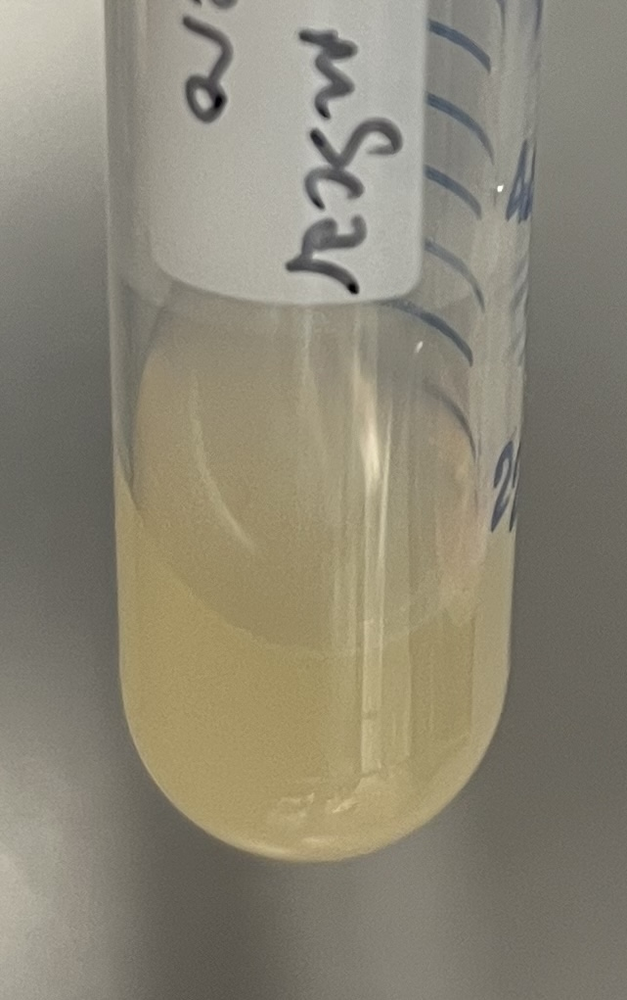

# Lab Equipment Glossary
Look here for definitions of the equipment and materials around the lab.

## 15mL tube (also called 15mL conical tube)
This is a tube with a screw cap which is helpful for spinning down, storing, and transporting samples. It holds a maximum of 15mL (about one tablespoon).

## 50mL tube (also called 50mL conical tube)
This is a tube with a screw cap which is helpful for spinning down, storing, and transporting samples. We also use them for collecting environmental samples. It holds a maximum of 50mL (a little less than one quarter cup).

## Bead Bath
This is a container with small metal beads kept at a warm temperature. We use it to store reagents that need to be kept warm. For example, we store the top agar in the beed bath so that it won’t solidify before we use it.

## Centrifuge
These are a set of machines that quickly spin samples in circles. As they spin, the heavier parts of the samples will go towards the bottom of the tube. This usually results in cells at the bottom and liquid at the top. Below are the three types of centrifuges we have in the lab.

### Ultra Centrifuge
This is a centrifuge capable of spinning large tubes. We will use it to spin 50mL tubes with the environmental samples.

### Table Top Centrifuge
This is a centrifuge capable of spinning small tubes very fast. We will use it to spin 1.5mL tubes.

### Minifuge Centrifuge
This is a very small centrifuge capable of spinning small tubes for a short period of time at a relatively slow speed. These are most helpful if your sample has collected on the side or top of a 1.5mL tube. A quick spin in the minifuge will collect your sample at the bottom of the tube.

## Culture Tube
This is a tube with a push on cap that we use for growing cells in liquid. These tubes and lids are specially made so that air can flow in and out of the tube while the cells are growing. Although the maximum volume is 14mL, we won’t grow cells in more than a few mL of liquid to make sure there is enough space for the air to move around inside the tubes.

## Incubator
This is a cabinet that is kept at a very specific temperature for growing cells. Ours will be kept at 30ºC (86ºF).

## Liquid Culture
This is the term used for cells growing in liquid in a tube. This is in contrast to cells growing on a plate.

## Microcentrifuge tube (also called Eppendorf tube or 1.5mL tube)
This is a tube with a flip up cap. They are useful for spinning, processing, and storing relatively small volumes. The maximum volume is 1.5mL (a little more than a quarter teaspoon).

## Pipette
These are tools we use for moving liquids around during experiments. There are different sizes and types depending on how much volume you want to move. Every pipette you use will also need a disposable tip for each step to avoid contamination. The pipettes we will use and their corresponding tips are described below.

### Micropipette (also called pipette)
This is the tool we use for moving small volumes. They come in four sizes labeled P2, P20, P200, and P1000. The P2 can move 0.5-2uL, the P20 can move 2-20uL, the P200 can move 20-200uL, and the P1000 can move 200-1000uL. There is more information on these in the [anatomy of a pipette](../labprotocols/protocol_02_pipettingexercises.html) tutorial.

### Pipette Tips
These are sterile disposable plastic parts that fit onto the end of a micropipette to pick up and move liquid. Be sure to use a new one for every step in your experiment to avoid contamination of samples and reagents.

### Serological Pipette
This is used for moving larger volumes of liquid than the micropipettes can handle. These can move between 1 and 50mL at a time.

### Serological Pipette Tips
These are sterile disposable parts that fit onto the end of a serological pipette to pick up and move liquid. Be sure to use a new one for every step in your experiment to avoid contamination of samples and reagents.

## Phage Lysate
This is a concentrated liquid sample of phage. There should be no bacterial cells present in your lysate.

## Plate (also called Petri dish)
This is a plastic dish that we use to grow bacteria and phage. Most of the ones we use this summer will already be filled with media and agar which give the bacteria the nutrients they need to grow.

## SM Buffer
This is the liquid we will use to store the phages we isolate. It has a few different salts in it that will hopefully keep the phages stable for a long time.

## Steriflip Vacuum Filter
This is a disposable piece of equipment we will use to filter the solids out of our environmental samples. The filter will allow liquid and very small particles (like phage) to pass through but will stop larger bits like cells from getting into the final product. Make sure to use a new one for each sample to avoid contamination.

## Syringe
This is a disposable tube with a plunger that we will use to push samples through a filter. They come in many sizes depending on the volume of your sample to be filtered. Make sure to use a new one for each sample to avoid contamination.

## Syringe Filter
This is a sterile disposable part that twists onto the end of the syringes. As we push sample through with the syringe, the liquid and phages will pass but the cells will not.

## Top Agar
This is what we will use for making lawns of bacteria when we screen for phages. It is liquid when it’s hot and solid when it reaches room temperature. We will add bacteria and phage to it while it is liquid, and then pour it onto plates where it will solidify. You can find it in its liquid state in the bead bath.

## Tube Rack
This is a piece of equipment that will stand your tubes up while you use them. It’s helpful while you are doing experiments as well as for storing tubes when you aren’t using them.

## Vortex
This is a machine that quickly shakes tubes and mixes up whatever sample is in the tube. Most will have a switch that has three options: On, Off, and Touch. Flip the switch to Touch. Now whenever you press a tube onto the rubber platform, the shaking will start.

